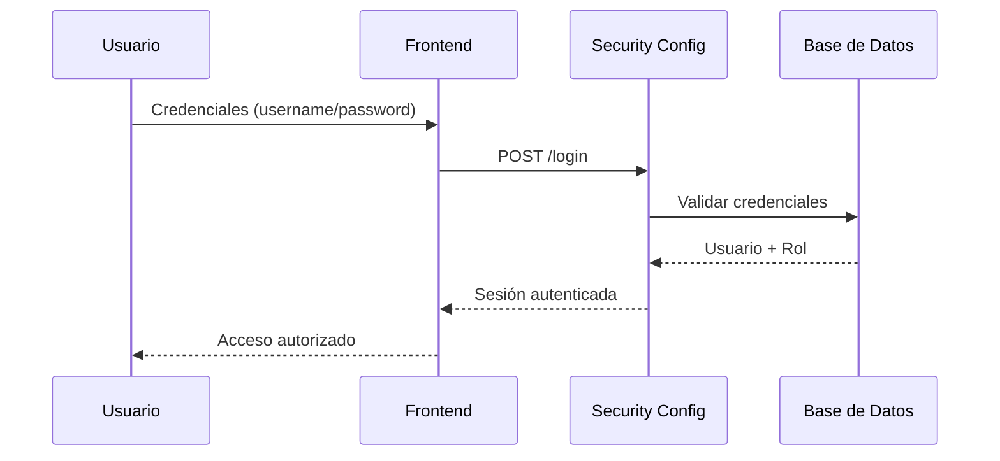

<div align="center">

# 🍽️ Sabor Gourmet

### Sistema Integral de Gestión Gastronómica

[](https://www.oracle.com/java/)
[](https://spring.io/projects/spring-boot)
[](https://mariadb.org/)
[](https://getbootstrap.com/)
[](LICENSE)

<p align="center">
  <i>Plataforma empresarial para la gestión eficiente de operaciones gastronómicas con seguridad de nivel empresarial y trazabilidad completa</i>
</p>

[Características](#-características-principales) •
[Arquitectura](#-arquitectura-del-sistema) •
[Instalación](#-guía-de-instalación) •
[Documentación](#-documentación) •
[Contribuir](#-contribución)

</div>

---

## 📋 Tabla de Contenidos

- [Descripción General](#-descripción-general)
- [Características Principales](#-características-principales)
- [Arquitectura del Sistema](#-arquitectura-del-sistema)
- [Sistema de Seguridad](#-sistema-de-seguridad)
- [Modelo de Datos](#-modelo-de-datos)
- [Guía de Instalación](#-guía-de-instalación)
- [Uso del Sistema](#-uso-del-sistema)
- [Stack Tecnológico](#-stack-tecnológico)
- [Roadmap](#-roadmap)
- [Contribución](#-contribución)
- [Licencia](#-licencia)
- [Contacto](#-contacto)

---

## 🎯 Descripción General

**Sabor Gourmet** es una solución empresarial de gestión gastronómica construida con tecnologías Java enterprise. El sistema proporciona una plataforma robusta y escalable para administrar todos los aspectos operativos de establecimientos gastronómicos, desde la gestión de clientes hasta el control de mesas, con un enfoque en seguridad, trazabilidad y eficiencia operativa.

### ✨ ¿Por qué Sabor Gourmet?

- ✅ **Trazabilidad Total**: Cada acción queda registrada con usuario, fecha y entidad afectada
- ✅ **Seguridad Empresarial**: Autenticación y autorización basada en roles con Spring Security
- ✅ **Arquitectura Escalable**: Diseño modular basado en principios SOLID y patrones MVC
- ✅ **Auditoría Completa**: Sistema de bitácora automático para cumplimiento normativo
- ✅ **Interfaz Moderna**: UI responsive desarrollada con Bootstrap 5.3

---

## 🚀 Características Principales

<table>
<tr>
<td width="50%">

### 👥 Gestión de Clientes
- CRUD completo de clientes
- Búsqueda y filtrado avanzado
- Historial de interacciones
- Validación de datos en tiempo real
- Exportación de datos

</td>
<td width="50%">

### 🪑 Control de Mesas
- Gestión de disponibilidad en tiempo real
- Estados: Disponible, Ocupada, Reservada, Mantenimiento
- Asignación inteligente de capacidad
- Visualización gráfica del layout
- Gestión de reservaciones

</td>
</tr>
<tr>
<td width="50%">

### 📜 Sistema de Bitácora
- Registro automático de operaciones
- Filtrado por usuario, acción y fecha
- Exportación de reportes de auditoría
- Trazabilidad completa de cambios
- Cumplimiento normativo

</td>
<td width="50%">

### 🔐 Seguridad Avanzada
- Autenticación JWT (en desarrollo)
- Control de acceso basado en roles (RBAC)
- Cifrado BCrypt para contraseñas
- Protección CSRF
- Sesiones seguras

</td>
</tr>
</table>

---

## 🏗️ Arquitectura del Sistema

```
┌─────────────────────────────────────────────────────────────┐
│                      CAPA DE PRESENTACIÓN                    │
│         HTML5 + Bootstrap 5.3 + JavaScript (Fetch API)      │
└────────────────────┬────────────────────────────────────────┘
                     │
┌────────────────────▼────────────────────────────────────────┐
│                   CAPA DE CONTROLADORES                      │
│              REST Controllers (Spring MVC)                   │
│    ClienteController | MesaController | BitacoraController  │
└────────────────────┬────────────────────────────────────────┘
                     │
┌────────────────────▼────────────────────────────────────────┐
│                    CAPA DE SERVICIOS                         │
│                   Lógica de Negocio                         │
│     ClienteService | MesaService | BitacoraService          │
└────────────────────┬────────────────────────────────────────┘
                     │
┌────────────────────▼────────────────────────────────────────┐
│                 CAPA DE REPOSITORIOS                         │
│               Spring Data JPA Repositories                   │
└────────────────────┬────────────────────────────────────────┘
                     │
┌────────────────────▼────────────────────────────────────────┐
│                    BASE DE DATOS                             │
│                   MariaDB 11.0+                             │
└─────────────────────────────────────────────────────────────┘
```

### 📁 Estructura del Proyecto

```
sabor-gourmet/
├── 📂 src/
│   ├── 📂 main/
│   │   ├── 📂 java/com/sabor/gourmet/
│   │   │   ├── 📂 config/              # Configuraciones (Security, CORS)
│   │   │   ├── 📂 controller/          # Controladores REST
│   │   │   ├── 📂 domain/              # Entidades JPA
│   │   │   │   ├── Cliente.java
│   │   │   │   ├── Mesa.java
│   │   │   │   ├── Usuario.java
│   │   │   │   └── Bitacora.java
│   │   │   ├── 📂 dto/                 # Data Transfer Objects
│   │   │   ├── 📂 repository/          # Interfaces JPA
│   │   │   ├── 📂 service/             # Servicios de negocio
│   │   │   │   ├── 📂 impl/           # Implementaciones
│   │   │   │   └── interfaces/        # Contratos
│   │   │   ├── 📂 exception/           # Manejo de excepciones
│   │   │   └── 📂 util/                # Utilidades y helpers
│   │   └── 📂 resources/
│   │       ├── 📂 static/              # Recursos estáticos
│   │       │   ├── 📂 css/
│   │       │   ├── 📂 js/
│   │       │   └── 📂 img/
│   │       ├── 📂 templates/           # Plantillas (si aplica)
│   │       ├── application.properties   # Configuración
│   │       └── data.sql                # Datos iniciales
│   └── 📂 test/                        # Tests unitarios e integración
├── 📂 docs/                            # Documentación adicional
├── 📄 pom.xml                          # Dependencias Maven
├── 📄 README.md
└── 📄 LICENSE
```

---

## 🔐 Sistema de Seguridad

### Modelo de Control de Acceso Basado en Roles (RBAC)

| Rol | Permisos | Casos de Uso |
|-----|----------|--------------|
| 🔴 **ADMIN** | Acceso total al sistema | Gestión de usuarios, configuración, reportes globales |
| 🟢 **MOZO** | Gestión de mesas y clientes | Atención al cliente, asignación de mesas, registro de pedidos |
| 🟡 **CAJERO** | Acceso a módulo de facturación | Procesamiento de pagos, cierre de caja, reportes de ventas |
| 🔵 **COCINERO** | Visualización de pedidos | Gestión de órdenes de cocina, actualización de estados |

### 🛡️ Características de Seguridad

```java
// Autenticación
- Cifrado de contraseñas con BCrypt (factor 12)
- Validación de credenciales con Spring Security
- Gestión de sesiones seguras

// Autorización
- Interceptores de seguridad por endpoint
- Anotaciones @PreAuthorize para control granular
- Validación de roles en capa de servicio

// Auditoría
- Registro automático en bitácora
- Identificación de usuario en cada operación
- Timestamp preciso de todas las acciones
```

### 🔄 Flujo de Autenticación



---

## 🗄️ Modelo de Datos

### Diagrama Entidad-Relación

```
┌─────────────────┐         ┌─────────────────┐
│    USUARIO      │         │    BITACORA     │
├─────────────────┤         ├─────────────────┤
│ 🔑 id           │────┐    │ 🔑 id           │
│ 📧 username     │    │    │ 🔗 id_usuario   │
│ 🔒 password     │    └───→│ 📝 accion       │
│ 👤 rol          │         │ 📦 entidad      │
│ ✅ activo       │         │ 🔗 entidad_id   │
└─────────────────┘         │ 📅 fecha_hora   │
                            └─────────────────┘

┌─────────────────┐         ┌─────────────────┐
│    CLIENTE      │         │      MESA       │
├─────────────────┤         ├─────────────────┤
│ 🔑 id           │         │ 🔑 id           │
│ 👤 nombre       │         │ 🔢 numero       │
│ 📧 email        │         │ 👥 capacidad    │
│ 📱 telefono     │         │ 📊 estado       │
│ 📅 fecha_reg    │         │ 📅 fecha_act    │
└─────────────────┘         └─────────────────┘
```

### 📊 Especificación de Tablas

<details>
<summary><b>👤 Tabla: usuario</b></summary>

| Campo | Tipo | Restricciones | Descripción |
|-------|------|---------------|-------------|
| `id` | BIGINT | PK, AUTO_INCREMENT | Identificador único |
| `username` | VARCHAR(50) | UNIQUE, NOT NULL | Nombre de usuario |
| `password` | VARCHAR(255) | NOT NULL | Contraseña cifrada con BCrypt |
| `rol` | VARCHAR(20) | NOT NULL | ADMIN, MOZO, CAJERO, COCINERO |
| `activo` | BOOLEAN | DEFAULT TRUE | Estado del usuario |
| `fecha_creacion` | DATETIME | DEFAULT CURRENT_TIMESTAMP | Fecha de creación |

</details>

<details>
<summary><b>📜 Tabla: bitacora</b></summary>

| Campo | Tipo | Restricciones | Descripción |
|-------|------|---------------|-------------|
| `id` | BIGINT | PK, AUTO_INCREMENT | Identificador único |
| `id_usuario` | BIGINT | FK → usuario(id) | Usuario que realizó la acción |
| `accion` | VARCHAR(50) | NOT NULL | CREAR, EDITAR, ELIMINAR, LOGIN |
| `entidad` | VARCHAR(50) | NOT NULL | Nombre de la entidad afectada |
| `entidad_id` | BIGINT | NULLABLE | ID de la entidad afectada |
| `detalles` | TEXT | NULLABLE | Información adicional en JSON |
| `fecha_hora` | DATETIME | DEFAULT CURRENT_TIMESTAMP | Timestamp de la operación |

</details>

<details>
<summary><b>👥 Tabla: cliente</b></summary>

| Campo | Tipo | Restricciones | Descripción |
|-------|------|---------------|-------------|
| `id` | BIGINT | PK, AUTO_INCREMENT | Identificador único |
| `nombre` | VARCHAR(100) | NOT NULL | Nombre completo |
| `email` | VARCHAR(100) | UNIQUE | Correo electrónico |
| `telefono` | VARCHAR(20) | NOT NULL | Número de contacto |
| `fecha_registro` | DATETIME | DEFAULT CURRENT_TIMESTAMP | Fecha de registro |

</details>

<details>
<summary><b>🪑 Tabla: mesa</b></summary>

| Campo | Tipo | Restricciones | Descripción |
|-------|------|---------------|-------------|
| `id` | BIGINT | PK, AUTO_INCREMENT | Identificador único |
| `numero` | INT | UNIQUE, NOT NULL | Número de mesa |
| `capacidad` | INT | NOT NULL | Cantidad de comensales |
| `estado` | VARCHAR(20) | NOT NULL | DISPONIBLE, OCUPADA, RESERVADA, MANTENIMIENTO |
| `fecha_actualizacion` | DATETIME | ON UPDATE CURRENT_TIMESTAMP | Última modificación |

</details>

---

## 📦 Guía de Instalación

### 📋 Requisitos Previos

| Requisito | Versión Mínima | Verificación |
|-----------|----------------|--------------|
| **Java JDK** | 17+ | `java -version` |
| **Maven** | 3.9+ | `mvn -version` |
| **MariaDB/MySQL** | 11.0+ | `mysql --version` |
| **Git** | 2.0+ | `git --version` |

### 🔧 Instalación Paso a Paso

#### 1️⃣ Clonar el Repositorio

```bash
git clone https://github.com/Hazielcode/Sabor-Gourmet-.git
cd Sabor-Gourmet-
```

#### 2️⃣ Configurar Base de Datos

```sql
-- Crear base de datos
CREATE DATABASE sabor_gourmet CHARACTER SET utf8mb4 COLLATE utf8mb4_unicode_ci;

-- Crear usuario (opcional)
CREATE USER 'sabor_user'@'localhost' IDENTIFIED BY 'your_secure_password';
GRANT ALL PRIVILEGES ON sabor_gourmet.* TO 'sabor_user'@'localhost';
FLUSH PRIVILEGES;
```

#### 3️⃣ Configurar application.properties

```properties
# src/main/resources/application.properties

# Database Configuration
spring.datasource.url=jdbc:mariadb://localhost:3306/sabor_gourmet
spring.datasource.username=sabor_user
spring.datasource.password=your_secure_password
spring.datasource.driver-class-name=org.mariadb.jdbc.Driver

# JPA Configuration
spring.jpa.hibernate.ddl-auto=update
spring.jpa.show-sql=true
spring.jpa.properties.hibernate.format_sql=true
spring.jpa.properties.hibernate.dialect=org.hibernate.dialect.MariaDBDialect

# Server Configuration
server.port=8080
server.servlet.context-path=/

# Logging
logging.level.com.sabor.gourmet=DEBUG
logging.level.org.springframework.security=DEBUG
```

#### 4️⃣ Compilar y Ejecutar

```bash
# Compilar el proyecto
mvn clean install

# Ejecutar la aplicación
mvn spring-boot:run

# O usando el JAR generado
java -jar target/sabor-gourmet-1.0.0.jar
```

#### 5️⃣ Verificar Instalación

Accede a: **http://localhost:8080**

**Credenciales por defecto:**
```
Usuario: admin
Contraseña: admin
```

> ⚠️ **IMPORTANTE**: Cambia las credenciales por defecto en producción.

---

## 💻 Uso del Sistema

### 🎨 Interfaz de Usuario

El sistema cuenta con una interfaz moderna y responsive desarrollada con Bootstrap 5.3:

#### 🏠 Dashboard Principal
- Resumen de operaciones del día
- Indicadores de mesas disponibles/ocupadas
- Accesos rápidos a módulos principales

#### 👥 Módulo de Clientes (`/clientes.html`)
```javascript
// Funcionalidades disponibles
✓ Listar todos los clientes
✓ Buscar por nombre, email o teléfono
✓ Registrar nuevo cliente
✓ Editar información existente
✓ Eliminar cliente (soft delete)
✓ Ver historial de interacciones
```

#### 🪑 Módulo de Mesas (`/mesas.html`)
```javascript
// Funcionalidades disponibles
✓ Visualización de layout del restaurante
✓ Cambio de estado en tiempo real
✓ Asignación de mesas a clientes
✓ Gestión de reservaciones
✓ Control de capacidad
```

#### 📜 Módulo de Bitácora (`/bitacora.html`)
```javascript
// Funcionalidades disponibles
✓ Filtrado por fecha, usuario y acción
✓ Exportación a PDF/Excel
✓ Búsqueda avanzada
✓ Visualización detallada de cambios
```

### 🔌 API REST Endpoints

<details>
<summary><b>👥 Cliente API</b></summary>

```http
GET    /api/clientes              # Listar todos los clientes
GET    /api/clientes/{id}         # Obtener cliente por ID
POST   /api/clientes              # Crear nuevo cliente
PUT    /api/clientes/{id}         # Actualizar cliente
DELETE /api/clientes/{id}         # Eliminar cliente
GET    /api/clientes/buscar?q=    # Buscar clientes
```

**Ejemplo de Solicitud:**
```json
POST /api/clientes
Content-Type: application/json

{
  "nombre": "Juan Pérez",
  "email": "juan.perez@email.com",
  "telefono": "+51987654321"
}
```

</details>

<details>
<summary><b>🪑 Mesa API</b></summary>

```http
GET    /api/mesas                 # Listar todas las mesas
GET    /api/mesas/{id}            # Obtener mesa por ID
POST   /api/mesas                 # Crear nueva mesa
PUT    /api/mesas/{id}            # Actualizar mesa
DELETE /api/mesas/{id}            # Eliminar mesa
PATCH  /api/mesas/{id}/estado     # Cambiar estado de mesa
GET    /api/mesas/disponibles     # Listar mesas disponibles
```

**Ejemplo de Solicitud:**
```json
POST /api/mesas
Content-Type: application/json

{
  "numero": 10,
  "capacidad": 4,
  "estado": "DISPONIBLE"
}
```

</details>

<details>
<summary><b>📜 Bitácora API</b></summary>

```http
GET    /api/bitacora                      # Listar registros
GET    /api/bitacora/usuario/{id}         # Filtrar por usuario
GET    /api/bitacora/fecha?desde=&hasta=  # Filtrar por rango de fechas
GET    /api/bitacora/entidad/{nombre}     # Filtrar por entidad
```

</details>

---

## 🛠️ Stack Tecnológico

### Backend

| Tecnología | Versión | Propósito |
|------------|---------|-----------|
| **Java** | 17 LTS | Lenguaje de programación |
| **Spring Boot** | 3.3.3 | Framework principal |
| **Spring Security** | 6.x | Autenticación y autorización |
| **Spring Data JPA** | 3.x | Persistencia de datos |
| **Hibernate** | 6.x | ORM |
| **Maven** | 3.9+ | Gestión de dependencias |

### Frontend

| Tecnología | Versión | Propósito |
|------------|---------|-----------|
| **HTML5** | - | Estructura |
| **CSS3** | - | Estilos |
| **Bootstrap** | 5.3 | Framework UI |
| **JavaScript** | ES6+ | Interactividad |
| **Fetch API** | - | Consumo de API REST |

### Base de Datos

| Tecnología | Versión | Propósito |
|------------|---------|-----------|
| **MariaDB** | 11.0+ | Motor de base de datos principal |
| **MySQL** | 8.0+ | Alternativa compatible |

### Herramientas de Desarrollo

- **IDE**: IntelliJ IDEA / Eclipse / VS Code
- **Control de Versiones**: Git + GitHub
- **Testing**: JUnit 5, Mockito
- **Documentación**: Swagger/OpenAPI (en desarrollo)

---

## 🗺️ Roadmap

### ✅ Versión 1.0 (Actual)
- [x] CRUD de clientes y mesas
- [x] Sistema de autenticación
- [x] Control de acceso por roles
- [x] Bitácora de auditoría
- [x] Interfaz responsive

### 🚧 Versión 1.5 (En Desarrollo)
- [ ] Módulo de pedidos y comandas
- [ ] Integración con cocina
- [ ] Sistema de notificaciones en tiempo real
- [ ] Dashboard analytics avanzado
- [ ] API REST documentation (Swagger)

### 🔮 Versión 2.0 (Planificado)
- [ ] Módulo de inventarios
- [ ] Integración con sistema de pagos
- [ ] Aplicación móvil (Android/iOS)
- [ ] Reportes avanzados con gráficos
- [ ] Integración con servicios de delivery
- [ ] Multi-sucursal

### 🌟 Versión 3.0 (Futuro)
- [ ] Machine Learning para predicción de demanda
- [ ] Sistema de recomendaciones
- [ ] Integración con IoT (sensores de mesa)
- [ ] Marketplace de proveedores
- [ ] API pública para integraciones

---

## 🤝 Contribución

¡Las contribuciones son bienvenidas! Este proyecto sigue las mejores prácticas de código abierto.

### 📝 Guía de Contribución

1. **Fork** el repositorio
2. **Crea** una rama para tu feature (`git checkout -b feature/AmazingFeature`)
3. **Commit** tus cambios (`git commit -m 'Add some AmazingFeature'`)
4. **Push** a la rama (`git push origin feature/AmazingFeature`)
5. **Abre** un Pull Request

### 🎯 Estándares de Código

- Seguir convenciones de Java (Google Java Style Guide)
- Escribir tests para nuevas funcionalidades
- Documentar métodos públicos con Javadoc
- Mantener cobertura de tests > 80%
- Código en inglés, comentarios en español

### 🐛 Reportar Bugs

Usa el [sistema de issues](https://github.com/Hazielcode/Sabor-Gourmet-/issues) de GitHub proporcionando:
- Descripción clara del problema
- Pasos para reproducir
- Comportamiento esperado vs actual
- Screenshots (si aplica)
- Versión de Java/Spring Boot

---

## 📄 Licencia

Este proyecto está licenciado bajo la **Licencia MIT** - ver el archivo [LICENSE](LICENSE) para más detalles.

```
MIT License

Copyright (c) 2025 Samir Haziel Alfonso Solorzano

Se concede permiso, de forma gratuita, a cualquier persona que obtenga una copia
de este software y archivos de documentación asociados (el "Software"), para usar
el Software sin restricciones, incluyendo sin limitación los derechos de usar,
copiar, modificar, fusionar, publicar, distribuir, sublicenciar y/o vender copias
del Software, y permitir a las personas a quienes se les proporcione el Software
hacer lo mismo, sujeto a las siguientes condiciones:

[Ver LICENSE para el texto completo]
```

---

## 📞 Contacto

### 👨‍💻 Desarrollador Principal

**Samir Haziel Alfonso Solorzano**  
Estudiante de Diseño y Desarrollo de Software  
TECSUP - Lima, Perú

<div align="center">

[](mailto:samir.haziel@tecsup.edu.pe)
[](https://github.com/Hazielcode)
[](https://linkedin.com)

</div>

### 🌐 Enlaces del Proyecto

- 🐛 [Reportar Bug](https://github.com/Hazielcode/Sabor-Gourmet-/issues)
- 💡 [Solicitar Feature](https://github.com/Hazielcode/Sabor-Gourmet-/issues)
- 📖 [Documentación](https://github.com/Hazielcode/Sabor-Gourmet-/wiki)
- 🔄 [Changelog](https://github.com/Hazielcode/Sabor-Gourmet-/releases)

---

<div align="center">

### 💬 "La excelencia en la gastronomía comienza con la excelencia en la gestión"

⭐ Si este proyecto te fue útil, considera darle una estrella en GitHub

**Hecho con ❤️ y ☕ en Perú**

</div>
